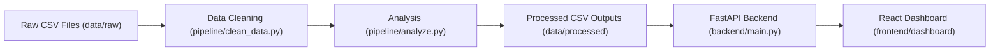

# customer_analytics_dashboard

## Project Overview
`customer_analytics_dashboard` is an end-to-end analytics application that generates synthetic customer/order/product data, cleans and enriches datasets, computes business analytics, serves results through FastAPI endpoints, and visualizes insights in a React dashboard.

## Architecture Diagram


## Project Architecture
Pipeline flow:
Raw CSV -> Data Cleaning -> Analysis -> FastAPI API -> React Dashboard

## Tech Stack
- Python 3.9+
- pandas, numpy
- FastAPI + Uvicorn
- React + Vite
- TailwindCSS
- Chart.js (`react-chartjs-2`)
- Docker + Docker Compose
- pytest

## Setup Instructions

### Prerequisites
- Python 3.9+
- Node.js 18+
- npm
- Docker (optional)

### 1. Install dependencies
```bash
pip install -r requirements.txt
pip install -r backend/requirements.txt
```

### 2. Generate sample data
```bash
python -m pipeline.generate_sample_data
```

### 3. Clean data
```bash
python -m pipeline.clean_data
```

### 4. Run analysis
```bash
python -m pipeline.analyze
```

### 5. Start backend
```bash
uvicorn backend.main:app --reload
```

### 6. Start frontend
```bash
cd frontend/dashboard
npm install
npm run dev
```

Frontend runs at `http://localhost:5173` and backend at `http://localhost:8000`.

## API Documentation
Base URL: `http://localhost:8000`

- `GET /health`
  Returns service health.
  Response:
  ```json
  { "status": "ok" }
  ```

- `GET /api/revenue`
  Returns monthly revenue trend.

- `GET /api/top-customers`
  Returns top customers with spend and churn status.

- `GET /api/categories`
  Returns category performance metrics.

- `GET /api/regions`
  Returns regional summary metrics.

If a required processed CSV is missing, API endpoints return `404` with:
```json
{ "detail": "Data file not found" }
```

## Docker Setup
Run backend and frontend with Docker Compose:
```bash
docker compose up --build
```

Exposed ports:
- `8000` (FastAPI backend)
- `5173` (React frontend)

Bind mounts include `./data` so generated/processed CSVs persist and are shared with the backend container.

## End-to-End Run Order
Run in this exact order for a full fresh setup:
1. `python -m pipeline.generate_sample_data`
2. `python -m pipeline.clean_data`
3. `python -m pipeline.analyze`
4. `uvicorn backend.main:app --reload`
5. `cd frontend/dashboard && npm install && npm run dev`

## Project Screenshots
Add dashboard screenshots here before final submission:

- Overview dashboard
  

- Revenue and category charts
  

- Top customers and regional analysis
  

## Testing
```bash
pytest
```
